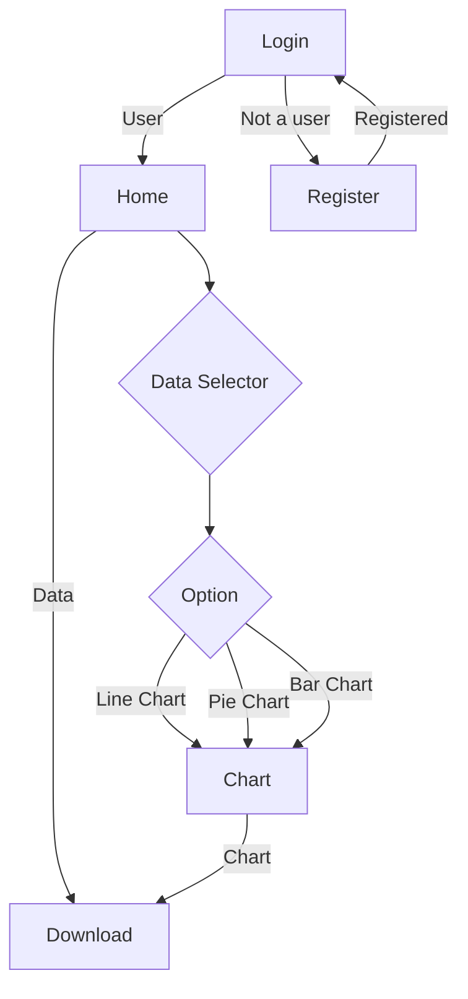

# TS-Data-Analysis-WebPage

TS-Data-Analysis-WebPage is Data Visualizer, which receives data from Firebase and visualizes it in line, bar, and pie chart form. The website allows downloading of data and the visual chart you need.

## Tech Stack

- **Frontend** - React + Vite.
- **Libaries** - Material UI(for UI components),Apache ECharts(for charts components).
- **Database** - Firebase

## Project Structure

```
DemoApp/
├── client/               # Frontend application (React + Vite)
│   ├── public/           # Public assets
│   │   ├── logo.svg      # favicon file in svg format
│   ├── src/
│   │   ├── assets/       # Static assets (images, icons)
│   │   ├── Components/   # Reusable UI components
│   │   │   ├── BarCharts.jsx
│   │   │   ├── ExcelDownloadButton.jsx
│   │   │   ├── LineCharts.jsx
│   │   │   ├── Loader.jsx
│   │   │   ├── NoDataFeild.jsx
│   │   │   ├── PieCharts.jsx
│   │   ├── Pages/        # Application pages
│   │   │   ├── Home.jsx
│   │   │   ├── Login.jsx
│   │   │   ├── Register.jsx
│   │   ├── Services/     # API service handlers
│   │   │   ├── Login.js
│   │   │   ├── Logout.js
│   │   │   ├── Register.js
│   │   ├── Utils/        #Utils handlers
│   │   │   ├── AuthChecker.js
│   │   │   ├── Config.js
│   │   │   ├── RegrexPassword.js
│   │   │   ├── ThemeChecker.js
│   │   ├── App.css
│   │   ├── App.jsx
│   │   ├── index.css
│   │   ├── main.jsx      # Entry point for Vite
├── .env                  # Environment variables for client-side
├── .gitignore            # Ignored files for Git
├── index.html
├── package.json
├── package-lock.json
├── eslint.config.js
├── README.md
└── vite.config.ts
```

## What Features Will You Find Here:

- **Dynamic Homepage:** Conveniently gathers essential information on a single page and responsive page design.
- **Best Practices:** Adherence to industry best practices, ensuring reusable and maintainable code.
- **Download Option:** Allow user to export the Data(Excel) or the Chart

## WorkFlow Diagram



## Environment Variables

Create a `.env` file within the `client` directory and populate it with your Firebase project credentials:

### Client (.env)

```
VITE_APIKEY="YOUR_FIREBASE_API_KEY"
VITE_AUTHDOMAIN="YOUR_FIREBASE_AUTH_DOMAIN"
VITE_DATABASEURL="YOUR_FIREBASE_DATABASE_URL"
VITE_PROJECTID="YOUR_FIREBASE_PROJECT_ID"
VITE_STORAGEBUCKET="YOUR_FIREBASE_STORAGE_BUCKET"
VITE_MESSAGINGSENDERID="YOUR_FIREBASE_MESSAGING_SENDER_ID"
VITE_APPID="YOUR_FIREBASE_APP_ID"
VITE_MEASUREMENTID="YOUR_FIREBASE_MEASUREMENT_ID"
```

## Installation

1. Install dependencies:

   ```bash
   cd client
   npm install
   ```

2. Start the development client:
   ```bash
   npm run dev
   ```
